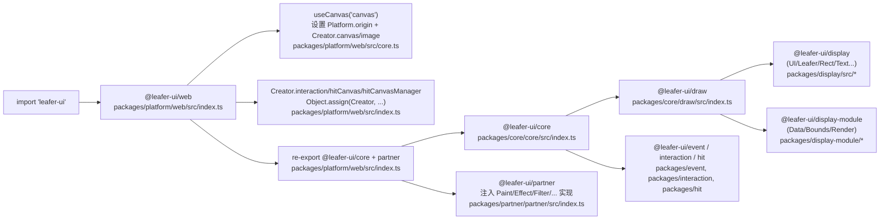

# 14. 全链路：从 import 到渲染 / 交互 / 命中（End-to-End Trace）

这篇文档的目标是：把 `leafer-ui` 在浏览器里“跑起来”的关键路径串成一条线。你可以把它当作一份断点清单 + 调用链地图。

## 1. 一张总览图（建议先看）

## 2. import 阶段：为什么“导入就能用”？

关键点在：`leafer-ui` 根入口只是转导出 `@leafer-ui/web`（见 `src/index.ts`），而 `@leafer-ui/web` 的入口文件会直接执行平台初始化：

- 文件：`packages/platform/web/src/index.ts`
  - 最后一行：`useCanvas('canvas')`

这会调用：

- 文件：`packages/platform/web/src/core.ts`
  - 设置 `Platform.origin`（创建 canvas、loadImage、download…）
  - 通过 `Object.assign(Creator, ...)` 注入 `Creator.canvas` / `Creator.image`
  - 设置 `Platform.name='web'`、UA/OS 开关、`devicePixelRatio` 等

同时 `packages/platform/web/src/index.ts` 还会装配：

- `Creator.interaction(...)`：使用 Web 端 `Interaction`（来自 `@leafer-ui/interaction-web`）
- `Creator.hitCanvas(...)`：创建 hitCanvas
- `Creator.hitCanvasManager()`：返回 `HitCanvasManager`

因此在 Web 环境里，“先 import，再 new Leafer/App”通常无需额外初始化动作。

## 3. 创建运行时实例：`new Leafer(...)` 的 init 做了什么？

入口类在：

- `packages/display/src/Leafer.ts`

核心流程集中在 `init(userConfig, parentApp?)`：

1) 设置 leafer 自身引用：`this.__setLeafer(this)`
2) 解析/合并 config（`DataHelper.assign`）
3) 创建 canvas + 三大控制器（都从 `Creator` 来）：
   - `this.canvas = Creator.canvas(config)`
   - `this.renderer = Creator.renderer(this, canvas, config)`
   - `this.watcher = Creator.watcher(this, config)`
   - `this.layouter = Creator.layouter(this, config)`
4) 非 App 场景（没有 parentApp）会额外创建：
   - `this.selector = Creator.selector(this)`
   - `this.interaction = Creator.interaction(this, canvas, this.selector, config)`
   - `this.hitCanvasManager = Creator.hitCanvasManager()`
   - `this.canvasManager = new CanvasManager()`
5) 事件监听 + 自动布局：`__listenEvents()`、`canvas.startAutoLayout(...)`
6) `start()`：启动控制器并触发首次渲染

这一段非常值得下断点（尤其是 `Creator.interaction(...)`，能确认你当前跑的是 Web/Worker/Node/miniapp 哪种交互实现）。

## 4. UI 属性到画面：Data → Bounds/Render → Canvas

### 4.1 属性怎么进入 Data？

`UI` 基类（`packages/display/src/UI.ts`）通过：

- `@dataProcessor(UIData)` 把属性写入/读取委托给 `UIData`

对应文件：

- `packages/display-module/data/src/UIData.ts`

例如：

- 你写 `rect.fill = '#4e7'`
  - 会触发 `UIData.setFill(...)`（归一化输入、标记透明度、维护 `__isFills` 等）
- 你写 `ui.path = 'M ... Z'`
  - 会触发 `UIData.setPath(...)`，用 `PathConvert.parse(...)` 转成统一命令数据

### 4.2 什么时候需要 compute paint？

当 fill/stroke 是对象/数组（渐变、图片 paint 等）时，`UIData` 会把输入记录到 `__input`，并标记 `__needComputePaint`。

之后在绘制阶段（见 `UIRender.__draw`），如果 `__needComputePaint` 为真，会执行：

- `UIData.__computePaint()` → `Paint.compute('fill'|'stroke', ui)`

注意：这里的 `Paint` 来自 `@leafer-ui/external`，它的真实实现通常由 `@leafer-ui/partner` 注入（见 `doc/10-external-partner.md`）。

### 4.3 Bounds 与 Render 的注入（mixin）

`UI` 通过：

- `@useModule(UIBounds)` + `@useModule(UIRender)`

把下面两个模块挂到实例上：

- `packages/display-module/bounds/src/UIBounds.ts`
- `packages/display-module/render/src/UIRender.ts`

其中：

- `UIBounds.__updateRenderSpread()` 会考虑 shadow/blur/filter/stroke 等扩张量（依赖 `Effect/Filter`）
- `UIRender.__draw(...)` 会走通用绘制管线（依赖 `Paint/Effect/Filter/ColorConvert`）

特定形状还会挂载自己的 fast render，例如：

- `Rect` 通过 `@useModule(RectRender)` 使用 `packages/display-module/render/src/RectRender.ts`

## 5. 交互：DOM 事件 → Interaction → emit（capture + bubble）

### 5.1 Web 监听与转换

文件：

- `packages/interaction/interaction-web/src/Interaction.ts`

它会对 canvas view 与 window 绑定监听，把 `PointerEvent/MouseEvent/TouchEvent/Wheel/Gesture` 转成内部事件数据，然后调用：

- `InteractionBase.pointerDown/pointerMove/pointerUp/...`

### 5.2 交互核心：如何拿到 path？

文件：

- `packages/interaction/interaction/src/Interaction.ts`

关键方法：

- `findPath(data, options?)`：
  - `this.selector.getByPoint(data, hitRadius, {...})`
  - 得到 `find.path` 与可选的 `find.throughPath`
  - 写回 `data.path` / `data.throughPath`

然后 `checkPath(...)` 会在一些模式下把 path 替换为默认路径（例如 moveMode）。

### 5.3 事件派发：`emit.ts`

文件：

- `packages/interaction/interaction/src/emit.ts`

它会按 `path` 做两段派发：

1) capture（从根到目标的反向遍历）
2) bubble（从目标到根的正向遍历）

并在 bubble 阶段（非 capture）做一件重要事情：

- `State.updateEventStyle(leaf, type)`（如果存在）  
  用于 hoverStyle/pressStyle 这类状态样式更新（`State` 来自 `@leafer-ui/draw`，对应 external 的可插拔能力）。

## 6. 命中与拾取：selector / hitCanvas / pixel hit

`@leafer-ui/hit` 的入口 `packages/hit/src/index.ts` 会通过副作用给多个原型挂载能力（见 `doc/09-hit.md`）。

你在交互里看到的 `selector.getByPoint(...)` 本质上依赖 hit/pick 体系：

- `Group.prototype.pick(...)`（`packages/hit/src/pick.ts`）
- `Leaf.prototype.hit(...)`（`packages/hit/src/LeafHit.ts`）
- `UI.prototype.__updateHitCanvas/__hit(...)`（`packages/hit/src/UIHit.ts`）

其中：

- path hit：用 `CanvasRenderingContext2D.isPointInPath/isPointInStroke`
- pixel hit：画一张缩放后的 hitCanvas，再用 `getImageData` 检测 alpha（更精确但更贵）
- `HitCanvasManager` 负责缓存命中画布，避免频繁分配

## 7. 断点建议（按你想查的问题选）

### 7.1 “为什么 import 后就能 new Leafer？”

- `packages/platform/web/src/index.ts`：`useCanvas('canvas')` 是否执行
- `packages/platform/web/src/core.ts`：`Platform.origin`/`Creator.canvas` 是否被设置

### 7.2 “为什么某个元素没画出来？”

- `packages/display/src/Leafer.ts`：`init()` 是否创建 renderer
- `packages/display-module/render/src/UIRender.ts`：`__draw(...)` 是否进入
- `packages/display-module/data/src/UIData.ts`：fill/stroke/path 是否被正确解析
- `packages/partner/partner/src/index.ts`：Paint/Effect 是否注入成功（否则 UIRender 调用会是空实现）

### 7.3 “点击/hover 没反应？”

- `packages/interaction/interaction-web/src/Interaction.ts`：事件监听是否绑定、坐标是否正确
- `packages/interaction/interaction/src/Interaction.ts`：`findPath()` 是否返回合理 path
- `packages/hit/src/*`：hitCanvas 是否更新、hitFill/hitStroke 配置是否导致未命中

